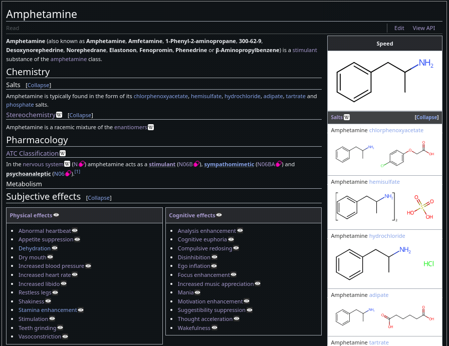
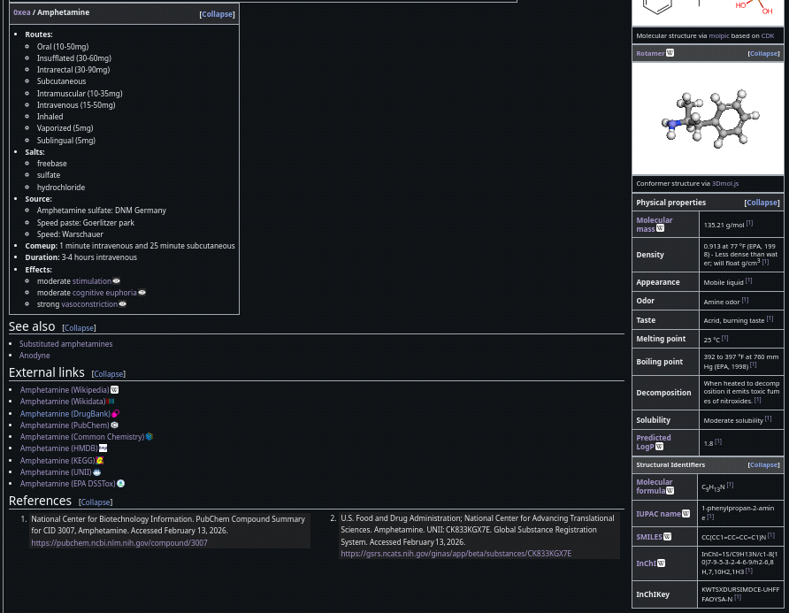
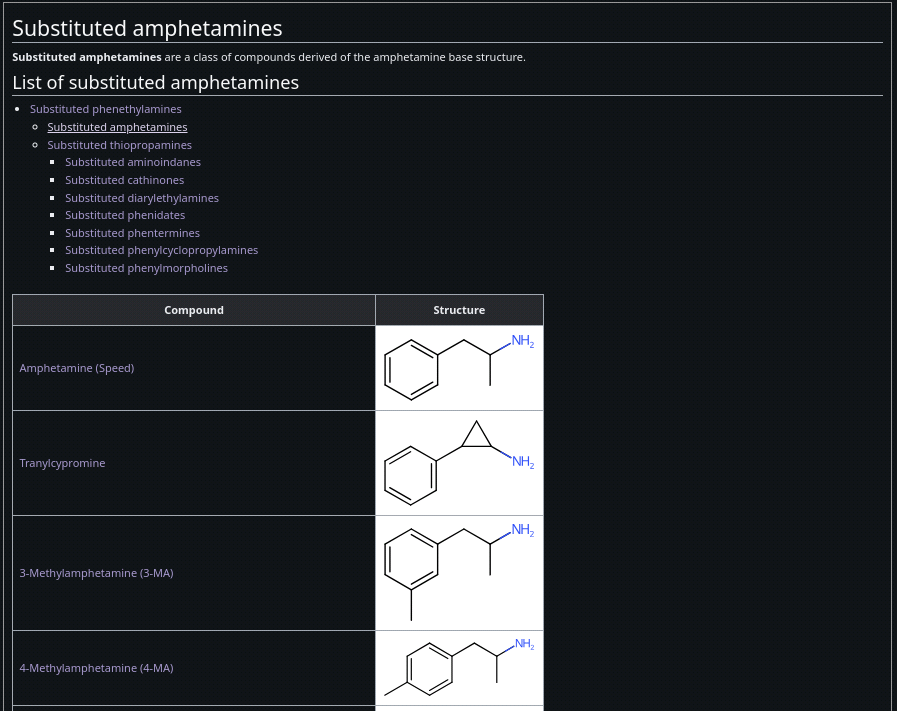

# AnodyneWiki

### Templated Frontend

[/substance/](/api/substance/amphetamine)

[/substituted/](/substituted/amphetamine)

### API Backend

For further assistance gladly reach out to: [0xea](https://anodyne.wiki/user/0xea)

* Substance index: [/api/index/substance](/api/index/substance)
    * Query substance: [/api/substance/](/api/substance/amphetamine)
* Query substitution class: [/api/substituted/](/api/substituted/amphetamine)
* Pharmacological class index: [/api/class/](/api/index/class)
    * Query pharmacological class: [/api/class/](/api/class/stimulant)
* Querying routes of administration: [/api/index/administration/](/api/index/administration)
    * Querying routes of administration: [/api/administaration/](/api/administration/intravenous)
* User index: [/api/index/user/](/api/index/user)
* Querying user: [/api/user/](/api/user/0xea)
