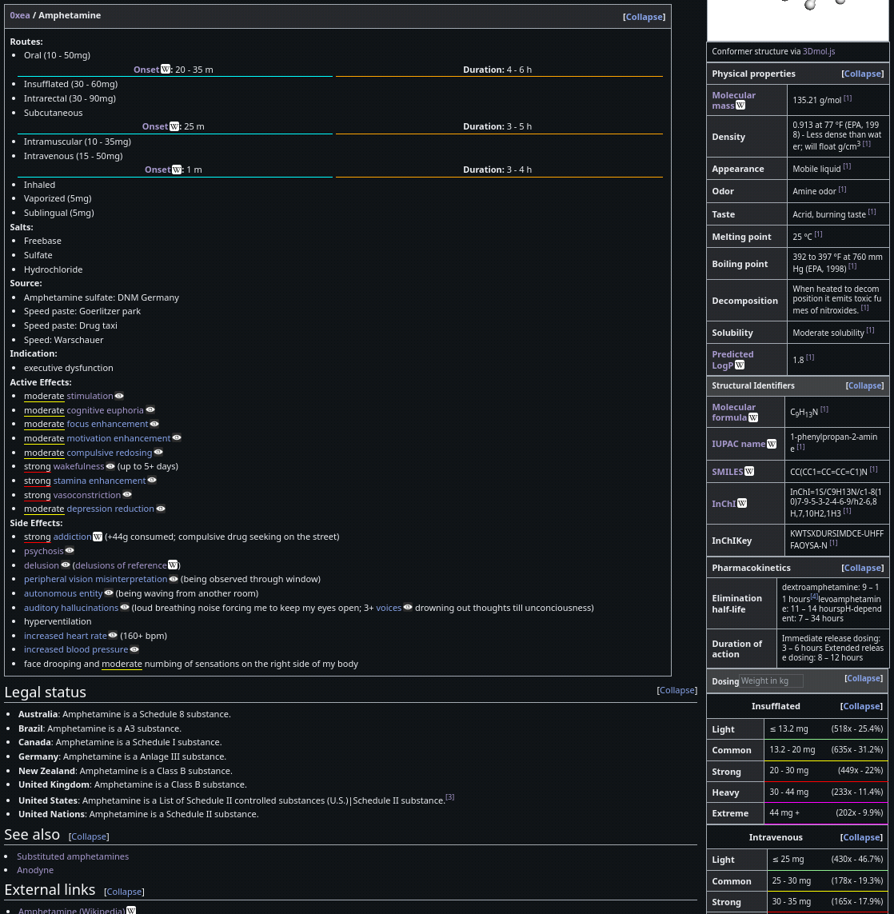
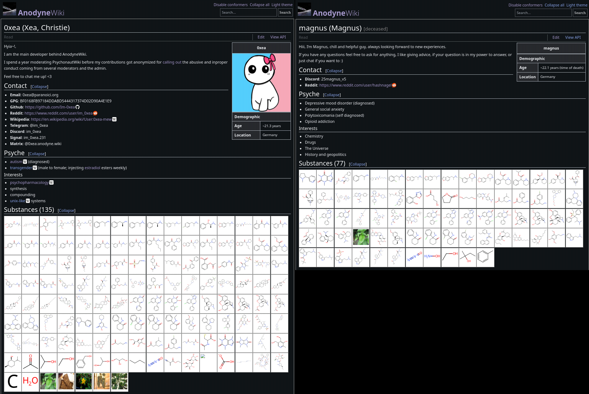
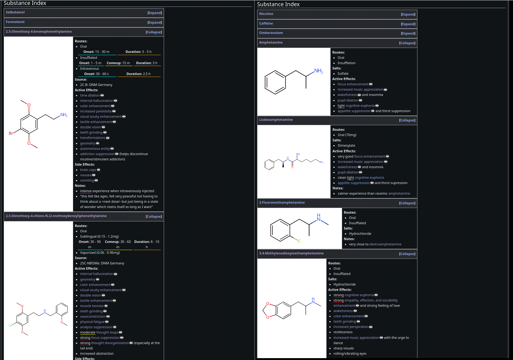

# AnodyneWiki

A meta-wiki optimized for chemicals affecting biological life-forms and their use and administration and interactions.

### Templated Frontend

Articles are generated on the fly by text/template templates from a set of data derived from an array of cheminformatics and pharmacology databases and toolsets.

[/index](https://anodyne.wiki/index/substance)
[/substance/amphetamine](https://anodyne.wiki/substance/amphetamine)

[/substituted/tryptamine](https://anodyne.wiki/substituted/tryptamine)

[/user/0xea](https://anodyne.wiki/user/0xea)
[/user/magnus](https://anodyne.wiki/user/magnus)

### API Backend

For further assistance gladly reach out to: [0xea](https://anodyne.wiki/user/0xea)

* Substance index: [/api/index/substance](/api/index/substance)
    * Query substance: [/api/substance/](/api/substance/amphetamine)
* Query substitution class: [/api/substituted/](/api/substituted/amphetamine)
* Pharmacological class index: [/api/class/](/api/index/class)
    * Query pharmacological class: [/api/class/](/api/class/stimulant)
* Querying routes of administration: [/api/index/administration/](/api/index/administration)
    * Querying routes of administration: [/api/administaration/](/api/administration/intravenous)
* User index: [/api/index/user/](/api/index/user)
* Querying user: [/api/user/](/api/user/0xea)

### Dependencies
- caddy (templated frontend and reverse-proxy)
- golang (backend api)
- ruby
- ruby-httparty (database scrapping)
- python
- rdkit (stereoisomer enumeration)
- [3Dmol.js](https://github.com/3dmol/3Dmol.js) / [jsmol](https://github.com/cheminfo/jsmol) (conformer viewer)
- [anodyne-molpic](https://github.com/AnodyneWiki/anodyne-molpic) (our CDK based cannonicalized molecular structure generation tool)
- [anodyne-chrp](https://github.com/AnodyneWiki/anodyne-chrp) (scrapping backend)
